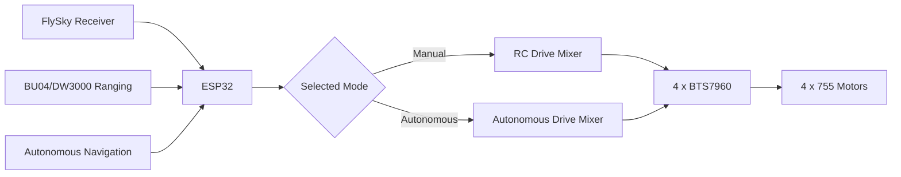

# Wiring Plan

This document captures the current logical wiring. Verify all connector labels and the exact ESP32 board pinout before applying power.

## Power

```text
12 V BATTERY +
    |
    +---- fuse / main disconnect / E-STOP ---- motor power distribution
    |                                           |
    |                                           +--> BTS7960 FL --> 755 FL motor
    |                                           +--> BTS7960 FR --> 755 FR motor
    |                                           +--> BTS7960 RL --> 755 RL motor
    |                                           +--> BTS7960 RR --> 755 RR motor
    |
    +---- 12 V -> 5 V BEC
             |
             +--> ESP32 logic supply
             +--> FlySky receiver
             +--> other compatible 5 V logic loads

Battery negative, driver logic ground, ESP32 ground and receiver ground share a common reference.
```

Do not put the fuse only in the ground conductor. The primary motor-power fuse/disconnect belongs in the positive supply path.

## Current proposed ESP32 motor pins

| Wheel | RPWM | LPWM | Enable |
|---|---:|---:|---:|
| Front Left | GPIO 13 | GPIO 14 | GPIO 27 |
| Front Right | GPIO 26 | GPIO 12 | GPIO 4 |
| Rear Left | GPIO 18 | GPIO 19 | GPIO 23 |
| Rear Right | GPIO 5 | GPIO 17 | GPIO 16 |

Each BTS7960 drives exactly one 755 motor.

## FlySky inputs

| Function | ESP32 |
|---|---:|
| Throttle | GPIO 32 |
| Steering | GPIO 33 |
| Mode | GPIO 25 |

The receiver and ESP32 must share ground.

## BU04 / DW3000 mower module

The corrected connection is SPI rather than a simple UART link.

| BU04 / DW3000 signal | Proposed ESP32 |
|---|---:|
| SPI CLK | GPIO 22 |
| SPI MOSI | GPIO 21 |
| SPI MISO | GPIO 34 |
| SPI CSN | GPIO 15 |
| IRQ | GPIO 35 |
| RESET | GPIO 2 |
| WAKEUP | GPIO 0 |

These are provisional assignments and must be checked against boot-strap behavior and the exact ESP32 board before final harness wiring.

## Control-source interlock



Only one control source is allowed to command propulsion at a time.
